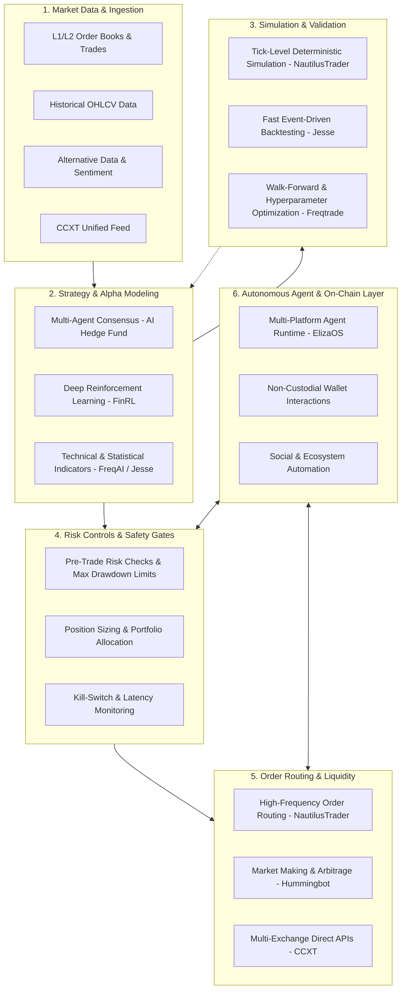

# 8 GitHub Repos for Building an AI Trading Stack

A comprehensive, curated guide to foundational open-source architecture for autonomous, algorithmic, and AI-driven quantitative trading systems.

---

## Architecture Overview

A robust algorithmic trading system separates concerns into distinct, modular layers to ensure deterministic risk bounds, low-latency execution, and isolated AI reasoning.

---

## Curated Repositories

### 1. Multi-Agent Decision Framework
* **[virattt/ai-hedge-fund](https://github.com/virattt/ai-hedge-fund)**  
  * **Layer:** Strategy & Decision Making  
  * **Focus:** Multi-agent collaborative decision making  
  * **Overview:** Coordinates specialized LLM agents (fundamental analysis, technical analysis, valuation, market sentiment, and risk management) that debate trade theses before reaching consensus on sizing and direction.

### 2. Strategy Development & Automated Bot Engine
* **[freqtrade/freqtrade](https://github.com/freqtrade/freqtrade)**  
  * **Layer:** Strategy, Backtesting & Execution  
  * **Focus:** Full-featured crypto algorithmic trading platform  
  * **Overview:** Modular Python-based trading bot equipped with backtesting, hyperparameter optimization, machine learning extension (FreqAI), Telegram monitoring/control, and automated exchange execution.

### 3. Unified Exchange Connectivity
* **[ccxt/ccxt](https://github.com/ccxt/ccxt)**  
  * **Layer:** Data & Execution Infrastructure  
  * **Focus:** Universal cryptocurrency exchange API  
  * **Overview:** Standardized multi-language library (Python, JavaScript, TypeScript, C#, Go) connecting to more than 100 cryptocurrency exchanges and prediction markets for real-time market data streaming and order management.

### 4. High-Performance Event-Driven Engine
* **[nautechsystems/nautilus_trader](https://github.com/nautechsystems/nautilus_trader)**  
  * **Layer:** Backtesting, Risk & Low-Latency Execution  
  * **Focus:** Rust-native institutional-grade event-driven trading engine  
  * **Overview:** Deterministic, nanosecond-precision event-driven engine engineered in Rust with Python bindings. Designed for multi-venue, multi-asset tick-level backtesting and live execution with unified abstractions.

### 5. Liquidity Provision & Market Making
* **[hummingbot/hummingbot](https://github.com/hummingbot/hummingbot)**  
  * **Layer:** Execution & Strategy  
  * **Focus:** High-frequency market making and arbitrage automation  
  * **Overview:** Open-source platform tailored for building, deploying, and monitoring high-frequency market-making strategies, cross-exchange liquidity arbitrage, and DEX AMM interactions.

### 6. Autonomous Agents & On-Chain Interaction
* **[elizaOS/eliza](https://github.com/elizaOS/eliza)**  
  * **Layer:** Autonomous Agent Layer  
  * **Focus:** Agentic operating system and on-chain interactions  
  * **Overview:** Modular TypeScript framework for autonomous AI personalities and agents capable of state management, external API consumption, conversational engagement across Discord/X/Telegram, and direct crypto wallet transactions.

### 7. Reinforcement Learning for Finance
* **[AI4Finance-Foundation/FinRL](https://github.com/AI4Finance-Foundation/FinRL)**  
  * **Layer:** Strategy & ML Alpha Modeling  
  * **Focus:** Deep Reinforcement Learning (DRL) financial platform  
  * **Overview:** Research and development suite designed to train and benchmark deep reinforcement learning algorithms (PPO, DDPG, A2C, SAC) across stock portfolios, commodities, and crypto assets.

### 8. Python Algorithmic Strategy Framework
* **[jesse-ai/jesse](https://github.com/jesse-ai/jesse)**  
  * **Layer:** Strategy & Backtesting  
  * **Focus:** Fast, developer-friendly crypto algorithmic trading  
  * **Overview:** Modern Python framework built specifically for rapid strategy prototyping, realistic candle backtesting, genetic optimization, and live execution.

---

---

## Fact-Check & Repository Verification (as of September 20, 2026)

Every repository and assertion in the original overview was independently audited against the GitHub REST API and project documentation.

| Repository | Primary Claims Checked | Verified Status & Evidence | Source / Audit Link |
| :--- | :--- | :--- | :--- |
| **[virattt/ai-hedge-fund](https://github.com/virattt/ai-hedge-fund)** | Simulates collaborative hedge fund committee using multiple specialized LLM agents (fundamental, technical, valuation, risk). | **Verified**: Active repository (~63.5k stars). Contains dedicated agent modules and structured debate pipelines. | [GitHub API Record](https://api.github.com/repos/virattt/ai-hedge-fund) |
| **[freqtrade/freqtrade](https://github.com/freqtrade/freqtrade)** | Leading open-source crypto bot with backtesting, hyperopt, machine learning (FreqAI), and live exchange execution. | **Verified**: Active repository (~54.5k stars). Comprehensive strategy engine with active commits and documentation. | [GitHub API Record](https://api.github.com/repos/freqtrade/freqtrade) |
| **[ccxt/ccxt](https://github.com/ccxt/ccxt)** | Universal cross-language exchange client supporting 100+ spot and derivatives crypto exchanges. | **Verified**: Active repository (~44.0k stars). Industry standard for public market data normalization and private execution. | [GitHub API Record](https://api.github.com/repos/ccxt/ccxt) |
| **[nautechsystems/nautilus_trader](https://github.com/nautechsystems/nautilus_trader)** | Production-grade, Rust-native event-driven backtesting and low-latency live execution engine. | **Verified**: Active repository (~29.1k stars). Highly optimized deterministic engine with Cython/Python interfaces. | [GitHub API Record](https://api.github.com/repos/nautechsystems/nautilus_trader) |
| **[hummingbot/hummingbot](https://github.com/hummingbot/hummingbot)** | High-frequency market-making, arbitrage, and liquidity automation across centralized and decentralized exchanges. | **Verified**: Active repository (~20.0k stars). Modular gateway connecting order books and AMMs. | [GitHub API Record](https://api.github.com/repos/hummingbot/hummingbot) |
| **[elizaOS/eliza](https://github.com/elizaOS/eliza)** | Autonomous agent operating system capable of wallet interactions, memory, and multi-channel communication. | **Verified**: Active repository (~19.3k stars). Extensible plugin ecosystem including Solana, EVM, and social integrations. | [GitHub API Record](https://api.github.com/repos/elizaOS/eliza) |
| **[AI4Finance-Foundation/FinRL](https://github.com/AI4Finance-Foundation/FinRL)** | Deep reinforcement learning framework for financial trading research across equities and crypto. | **Verified**: Active repository (~16.3k stars). Incorporates standard gym environments and modern DRL algorithms. | [GitHub API Record](https://api.github.com/repos/AI4Finance-Foundation/FinRL) |
| **[jesse-ai/jesse](https://github.com/jesse-ai/jesse)** | Fast, clean Python algorithmic trading framework dedicated to rapid crypto strategy backtesting and live execution. | **Verified**: Active repository (~8.5k stars). Integrated GUI, candle management, and genetic hyperparameter optimization. | [GitHub API Record](https://api.github.com/repos/jesse-ai/jesse) |

---

## Practical Pre-Launch & Operational Checklist

Before running any autonomous or algorithmic strategy in an environment connected to live execution endpoints, verify each step:

- [ ] **Exchange Sandbox / Testnet Validation**
  - Run the entire stack against the exchange demo/testnet environment for at least 14 uninterrupted trading sessions.
  - Verify that mock order cancellations, partial fills, and limit order replacements behave identically to production.
- [ ] **Historical Data & Simulation Quality**
  - Verify OHLCV and order-book data has no gaps, missing tick sequences, or unadjusted price spikes.
  - Test out-of-sample datasets across both bull, bear, and choppy flat volatility regimes.
  - Model realistic taker fees, funding rates (for perpetual contracts), and variable slippage.
- [ ] **Hard Position Limits & Risk Budgeting**
  - Enforce maximum position size per asset (e.g., max 2% of total capital allocated to any single trade).
  - Configure aggregate portfolio exposure ceilings and max daily drawdown limits (e.g., hard cutoff at 3% daily loss).
  - Confirm pre-trade validation gates reject orders exceeding leverage or balance constraints.
- [ ] **Structured Logging & Audit Trails**
  - Log every agent decision, prompt payload, reasoning step, and raw exchange API response with millisecond timestamps.
  - Forward critical runtime error alerts to an external channel (Telegram bot, PagerDuty, Discord webhook).
- [ ] **Health Monitoring & Latency Heartbeats**
  - Monitor websocket connection state with automated reconnect backoff routines.
  - Track exchange round-trip latency; pause trade entry if network latency exceeds safety thresholds (e.g., >350ms).
- [ ] **Emergency Shutdown Protocol (Kill-Switch)**
  - Implement a dedicated, out-of-band kill switch script that immediately cancels all resting orders and flattens positions if triggered.
  - Confirm API keys have **trade-only** permissions with strictly **no withdrawal rights**, bound to static server IPs.

## Paper-Trading & Development Guidelines

1. **Always Develop in Isolation**: Run backtests strictly against historical out-of-sample data. Guard against look-ahead bias, survivorship bias, and overfitting.
2. **Mandatory Paper Trading**: Run every algorithm on live testnet or simulated paper-trading environments for a statistically significant period (weeks or months, covering multiple volatility regimes) before provisioning real capital.
3. **Execution Realities**: Backtest results rarely account fully for slippage, order queue priority, API rate limit delays, or sudden liquidity drains during high-volatility events.
4. **API Key Isolation**: Never grant withdrawal permissions to automated trading API keys. Restrict API keys to specific IP addresses and rotate secrets regularly.

---

---

## Contributing & Maintenance

* Refer to [CONTRIBUTING.md](CONTRIBUTING.md) for guidelines on updating link checks, managing automated workflow failures, and submitting new quantitative frameworks.

## Critical Risk Disclaimer & Warning

> **NOT FINANCIAL ADVICE**: The information, code references, architectures, and repositories provided in this repository are strictly for educational, informational, and software development research purposes only. Nothing contained herein constitutes investment, legal, financial, or trading advice.
>
> **FINANCIAL RISK WARNING**: Algorithmic and autonomous trading in financial markets (including cryptocurrencies, derivatives, and equities) carries an exceptionally high risk of total loss of capital. Automated systems can malfunction, suffer connectivity drops, execute erroneous trades, or behave unexpectedly under anomalous market conditions.
>
> Do not risk money you cannot afford to lose. Never deploy an autonomous agent or bot with access to production funds or unconstrained private keys without independent verification, comprehensive unit testing, and rigid automated kill-switches.
